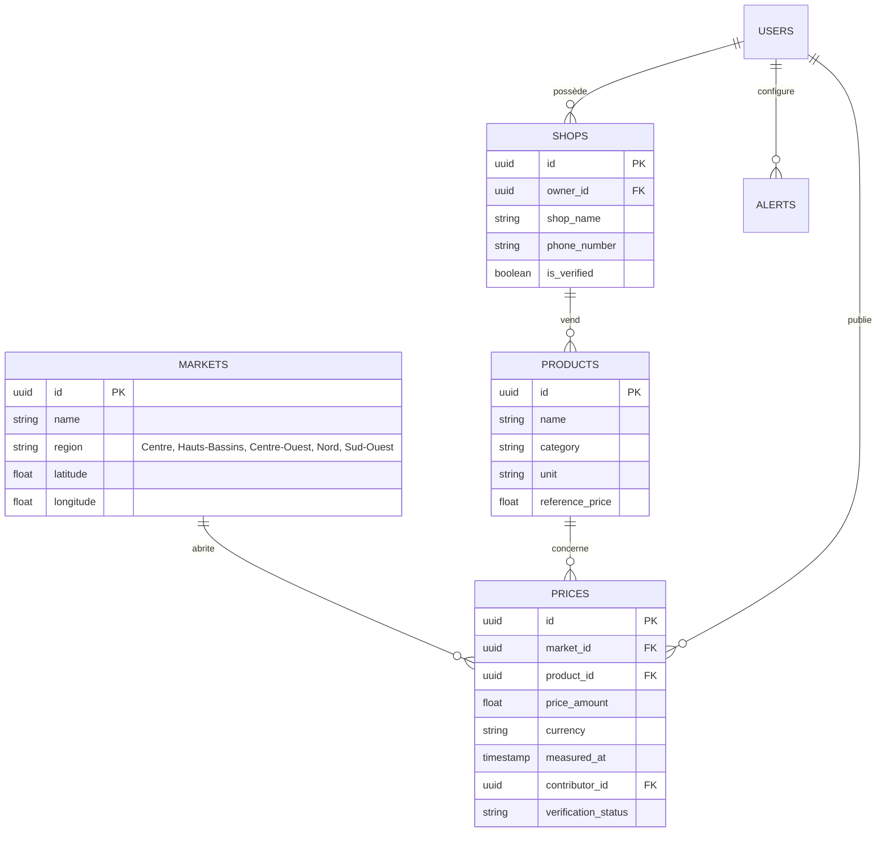

# 📊 DOSSIER DE PRÉSENTATION OFFICIEL
## MARKETRADAR / AVIPROD

> **Document de Synthèse Stratégique & Spécifications Techniques**  
> **Destinataires :** Investisseurs, Partenaires Institutionnels & Équipe de Développement  
> **Version :** 1.0.0 (Pilote Stratégique - Août 2026)  
> **Portée Géographique Pilote :** Burkina Faso — Focus sur 5 Pôles Stratégiques (Ouagadougou, Bobo-Dioulasso, Koudougou, Ouahigouya, Gaoua)  

---

## 🧭 1. Executive Summary & Vision Business (Pour Investisseurs)

### 1.1 Le Constat & La Problématique Terrain
Sur les marchés agricoles et de consommation en Afrique de l'Ouest (et particulièrement au Burkina Faso), la fixation des prix est caractérisée par une **opacité majeure** et une **forte volatilité inter-régionale**.

- **Disparités territoriales massives :** Pour un même produit (ex: sac de maïs de 100 kg), les prix varient fortement entre les zones de production et les centres urbains :
  - **Zone de production (Bobo / Dédougou / Gaoua) :** ~14 700 à 16 000 FCFA
  - **Hubs urbains et de consommation (Ouagadougou - Rood Woko / Koudougou / Ouahigouya) :** ~21 000 à 28 000 FCFA
  - Soit un écart de prix de **50 % à plus de 100 %** d'un pôle à un autre.
- **Asymétrie d'information :** Les acheteurs, ménages et commerçants n'ont aucun moyen rapide de comparer les prix en temps réel sans se déplacer physiquement.
- **Pertes pour les producteurs/vendeurs locaux :** Manque de visibilité numérique pour valoriser leurs stocks et attirer des acheteurs qualifiés.

### 1.2 La Stratégie de Lancement Pilote Ciblée (5 Pôles Clés)
Pour optimiser les ressources et maximiser la densité d'utilisateurs dès le lancement, **MarketRadar restreint initialement son déploiement à 5 villes/régions stratégiques du Burkina Faso** :

```
                        ┌────────────────────────────────────────┐
                        │   STRATÉGIE DE DÉPLOIEMENT PILOTE (V1) │
                        └───────────────────┬────────────────────┘
                                            │
   ┌───────────────────┬────────────────────┼───────────────────┬───────────────────┐
   ▼                   ▼                    ▼                   ▼                   ▼
┌──────────────┐    ┌──────────────┐    ┌──────────────┐    ┌──────────────┐    ┌──────────────┐
│ OUAGADOUGOU  │    │BOBO-DIOULASSO│    │  KOUDOUGOU   │    │  OUAHIGOUYA  │    │    GAOUA     │
│Centre - Hub  │    │Hauts-Bassins │    │ Centre-Ouest │    │ Nord - Hub   │    │  Sud-Ouest   │
│Consommation  │    │Prod. & Transit│   │  Carrefour   │    │ Céréalier    │    │ Prod. Fruit  │
└──────────────┘    └──────────────┘    └──────────────┘    └──────────────┘    └──────────────┘
```

1. **Ouagadougou (Région du Centre) :** Capitale politique et économique, principal bassin de consommation (Marchés Rood Woko, Sankariaré, Katr-Yaar).
2. **Bobo-Dioulasso (Région des Hauts-Bassins) :** Capitale économique, carrefour sous-régional et grand bassin de production agricole et avicole.
3. **Koudougou (Région du Centre-Ouest) :** Pôle commercial stratégique reliant le centre à l'ouest.
4. **Ouahigouya (Région du Nord) :** Pôle de collecte et d'échange de céréales et cultures maraîchères.
5. **Gaoua (Région du Sud-Ouest) :** Zone à fort potentiel de production fruitière, vivrière et d'élevage.

### 1.3 La Solution MarketRadar / Aviprod
MarketRadar apporte une réponse technologique adaptée au contexte local :

1. **Transparence instantanée des prix :** Suivi par produit, marché et pôle régional via une application mobile/web fluide.
2. **Collecte communautaire certifiée (Crowdsourcing GPS) :** Réseau de contributeurs locaux récompensés pour la saisie des prix avec preuve photo et géolocalisation.
3. **Boutiques numériques Vendeurs :** Digitalisation des commerçants avec annuaire, badges certifiés et contact direct (WhatsApp / Appel / Chat).
4. **Data Analytics pour Décideurs :** Tableau de bord d'analyse des variations de cours pour ONG, grossistes et coopératives.

---

## 💰 2. Modèle Économique & Stratégie de Monétisation

```
                                  ┌───────────────────────────┐
                                  │   ÉCOSYSTÈME MONÉTISE     │
                                  └─────────────┬─────────────┘
                                                │
         ┌──────────────────────────────────────┼──────────────────────────────────────┐
         ▼                                      ▼                                      ▼
┌─────────────────────────┐            ┌─────────────────────────┐            ┌─────────────────────────┐
│     SaaS Vendeurs B2B   │            │   Data & API Analytics  │            │ Sponsor & Alertes Pro   │
│  Abonnement Boutique VIP│            │   Rapports institutionnels│            │  Bannières ciblées par  │
│ Badge certifié & Vitrine│            │   pour ONG / Grossistes │            │   région & catégorie    │
└─────────────────────────┘            └─────────────────────────┘            └─────────────────────────┘
```

1. **Abonnement "Boutique Premium" (B2B) :**
   - Frais mensuels/annuels pour les vendeurs situés dans les 5 zones pilotes (Ouaga, Bobo, Koudougou, Ouahigouya, Gaoua) souhaitant une vitrine numérique mise en avant, des statistiques de consultation et la réception directe de prospects.
2. **Abonnements Data & API (B2B & Institutionnel) :**
   - Vente de données agrégées et de rapports de tendances de prix inter-villes aux agences de sécurité alimentaire, projets agritech, ONG et institutions financières.
3. **Services à valeur ajoutée & Commission Marketplace :**
   - Mise en relation qualifiée et transactions sécurisées sur la vente d'équipements et intrants (gestion des lots / aviculture / céréales).
4. **Publicité & Alertes Sponsorisées :**
   - Emplacements promotionnels réservés aux fournisseurs d'intrants et marques agroalimentaires sur les 5 villes pilotes.

---

## 📱 3. Fonctionnalités Clés du Produit

| Fonctionnalité | Description & Impact Utilisateur |
| :--- | :--- |
| **Price Ticker & Dashboard** | Flux défilant des variations de prix en temps réel sur les 5 zones pilotes, indicateurs de tendance (Sparklines) et top promos. |
| **Market Atlas (Carte Pilote)** | Carte interactive géolocalisée centrée sur les marchés clés de Ouagadougou, Bobo-Dioulasso, Koudougou, Ouahigouya et Gaoua. |
| **Relevé Terrain GPS** | Module d'ajout de prix sécurisé avec vérification des coordonnées GPS, photo du produit et validation par pairs. |
| **Gamification & Réputation** | Système de points, niveaux et badges pour stimuler l'engagement des contributeurs terrain dans les 5 hubs. |
| **Boutiques & Messagerie** | Annuaire interactif des vendeurs avec bouton de contact rapide (Chat in-app, WhatsApp, Téléphone). |
| **Système d'Alertes** | Notification push lorsqu'un produit ciblé passe sous un prix seuil défini par l'utilisateur. |

---

## 🛠️ 4. Architecture Technique & Stack (Pour Développeurs)

### 4.1 Technologies Utilisées

```
┌────────────────────────────────────────────────────────────────────────┐
│                        FRONTEND (iOS / Android / Web)                  │
│   React Native 0.83.6  │  Expo ~55  │  Expo Router  │  TypeScript 5.3    │
└───────────────────────────────────┬────────────────────────────────────┘
                                    │
                                    ▼
┌────────────────────────────────────────────────────────────────────────┐
│                        STATE & DATA FETCHING                           │
│              TanStack React Query v5  │  Expo SecureStore              │
└───────────────────────────────────┬────────────────────────────────────┘
                                    │ (PostgREST / WebSockets)
                                    ▼
┌────────────────────────────────────────────────────────────────────────┐
│                        BACKEND & INFRASTRUCTURE                        │
│      Supabase (PostgreSQL 15)  │  Supabase Auth  │  Edge Functions     │
└────────────────────────────────────────────────────────────────────────┘
```

- **Framework Mobile & Web :** React Native 0.83.6 avec Expo SDK 55 et `expo-router` (Navigation basée sur les fichiers).
- **Langage :** TypeScript 5.3 avec vérification stricte du typage (`npm run typecheck`).
- **Gestion d'état Serveur :** TanStack React Query v5 pour la mise en cache, la réhydratation rapide et l'invalidation des requêtes.
- **Back-End As A Service :** Supabase (Base de données PostgreSQL 15, Authentification JWT, Supabase Storage pour les images).
- **Logic Métier Serveur :** Supabase Edge Functions (Deno / TypeScript).
- **Composants d'Interface & Graphiques :** Lucide React Native, React Native Reanimated 4, React Native Maps, React Native SVG.
- **Tests & Qualité :** Vitest pour les tests unitaires et d'intégration.

---

## 🗄️ 5. Modélisation de la Base de Données (Supabase / Postgres)



### Filtre Régional par Défaut (Phase Pilote)
Un filtre par défaut sur la région/ville active est appliqué dans les requêtes Supabase :
```typescript
// Exemple de requête restreinte aux 5 zones pilotes
const PILOT_REGIONS = ['Centre', 'Hauts-Bassins', 'Centre-Ouest', 'Nord', 'Sud-Ouest'];

const { data, error } = await supabase
  .from('markets')
  .select('*, prices(*)')
  .in('region', PILOT_REGIONS);
```

---

## 🚀 6. Guide de Démarrage Rapide Développeur

### 6.1 Prérequis
- Node.js (v18+ LTS recommandé)
- npm ou yarn
- Application Expo Go (pour tester sur appareil mobile physique) ou un émulateur Android / iOS simulator.

### 6.2 Installation & Lancement Local
```bash
# 1. Cloner le dépôt et accéder au dossier
git clone <URL_DU_REPO>
cd marketradar

# 2. Installer les dépendances
npm install

# 3. Configurer les variables d'environnement
# Créer un fichier .env à la racine avec les identifiants Supabase :
# EXPO_PUBLIC_SUPABASE_URL=https://your-project.supabase.co
# EXPO_PUBLIC_SUPABASE_ANON_KEY=your-anon-key

# 4. Lancer le serveur de développement Expo
npm start

# 5. Lancer spécifiquement sur le web ou nettoyer le cache
npm run web
npm run start:clean
```

### 6.3 Vérification du Code & Tests
```bash
# Vérification des types TypeScript
npm run typecheck

# Exécution des tests unitaires avec Vitest
npm test
```

---

## 🗺️ 7. Roadmap de Déploiement & Expansion

```
Phase 1 : Lancement Pilote Restreint (T3 2026)
├── Focalisation exclusive sur Ouagadougou, Bobo, Koudougou, Ouahigouya & Gaoua
├── Recrutement et validation d'un noyau dur de 50 à 100 contributeurs terrain par ville
└── Validation de la densité de données de prix et du taux de conversion des boutiques VIP

Phase 2 : Extension Nationale Burkina Faso (T4 2026 - T1 2027)
├── Ouverture progressive aux 8 autres régions (Dédougou, Tenkodogo, Fada N'Gourma, Kaya, etc.)
├── Intégration Mobile Money (Orange Money, Moov, Wave) pour les abonnements
└── Lancement des abonnements Data B2B pour ONG et institutionnels

Phase 3 : Expansion Sous-Régionale (2027+)
├── Déploiement en Côte d'Ivoire (Abidjan, Bouaké), Mali (Bamako, Sikasso) et Niger (Niamey)
├── Module de prédiction des prix assisté par IA
└── Marketplace B2B d'intrants et d'équipements agricoles & avicoles
```

---

## 📞 8. Contact & Informations Projets

- **Porteur de Projet :** Équipe MarketRadar / Aviprod  
- **Contact Technique & Investisseurs :** contact@marketradar.bf / dev@marketradar.bf  
- **Dépôt du Code Source :** Projet confidentiel sous licence fermée / Partenaires autorisés  
